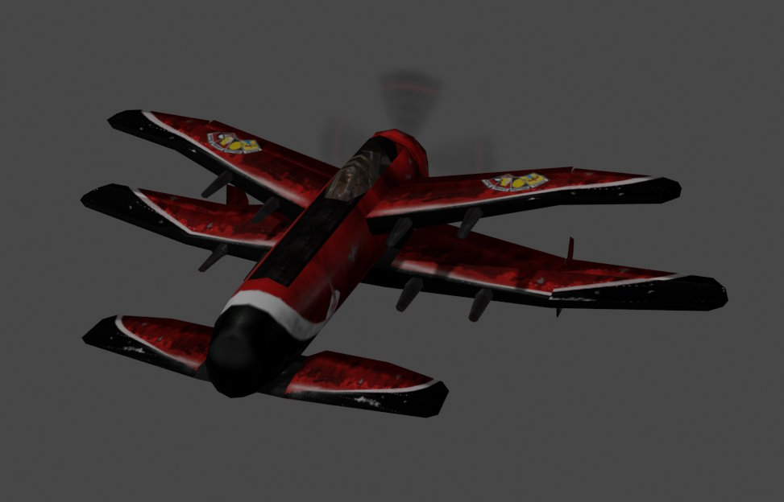

## What is this?

These scripts can help you extract assets from the PC game Crimson Skies (2000). They use [tobywf's mech3ax](https://github.com/TerranMechworks/mech3ax) to extract useful data from proprietary `.zbd` files, and then assemble these into `.blend` files which you can use in your own projects.



## How do I work this?

Of course you will need a copy of Crimson Skies. I can't help you with this.

Then you can download the code in this repo. Click the green 'Code' button and then 'Download ZIP'. You should unzip it after.

Then you will need to install some free software:

- [Python](https://www.python.org/downloads/), a programming language, for running the script
- [Blender](https://www.blender.org/download/), a program for working with 3D models

And lastly, you need a copy of mech3ax, the program that does the actual extracting. [Download the latest release from here](https://github.com/TerranMechworks/mech3ax/releases/latest). You only need the `.zip` file which matches your operating system. Unzip it and take a note of where the `unzbd.exe` file ends up.

Now you can open a command line in the folder you put my scripts in. You can do this by typing `cmd` into the address bar of that folder and hitting enter.

First we install one last dependency from the command line:
```
C:\crimsonskies2blend> pip install pillow
```
Now we can run our script. You will need to type out all these arguments in a single line, it's easiest to do it in notepad first then copy it in. A simple command would have this structure:
```
C:\crimsonskies2blend> python everything2blend.py <BLENDER EXE> --unzbd <UNZBD EXE> --zbd <CRIMSON SKIES ZBD FOLDER>
```

You will need to fill in your own values depending on where you've put things, but it will probably look like this:
```
C:\crimsonskies2blend> python everything2blend.py 
              "C:\Program Files\Blender Foundation\Blender 3.5\blender.exe"
              --unzbd "C:\Users\roz\Documents\crimson\mech3ax-v0.6.0-rc3\unzbd.exe"
              --zbd "C:\Program Files (x86)\Microsoft Games\Crimson Skies\ZBD"
```
(Remember to type everything in a single line when you do this. And be sure to have "quotes" around your paths).

## Where is that large automobile?

It's in one of those `.blend` files that just appeared, go check it out in Blender. Each file contains all the data it was possible to extract for that plane or level, so there will be some stuff you aren't interested in. The script tries to hide the boring stuff, but you can make it appear again with the eye buttons in the right-hand pane of Blender.

There are only minor issues remaining with these files. A few meshes are borked, some materials are incorrect and one or two textures are missing. But the assets are defiitely good enough to work with.

## What's all that other crap?

Those are the files generated by `unzbd.exe`, which contain the raw data. If you omit the `--zbd` and `--unzbd` arguments, the script can generate `.blend` files directly from these, which is much faster. If you don't want them clogging up your folder, you can use the other command line arguments to plop them somewhere else:
```
usage: everything2blend.py [-h] [--zips FOLDER] [--out FOLDER] [--zbd FOLDER] [--unzbd EXE] [--skip-planes] [--skip-levels] blender_exe

Convert dumped Crimson Skies plane model data to blender files.

positional arguments:
  blender_exe    Path to your Blender executable

options:
  -h, --help     show this help message and exit
  --zips FOLDER  Folder containing planes.zip and textures.zip
  --out FOLDER   Folder to save .blend files
  --zbd FOLDER   Path to ZBD folder in game files
  --unzbd EXE    Path to unzbd executable (will automate extraction if supplied). Requires --zbd
  --skip-planes  Don't generate .blends for planes
  --skip-levels  Don't generate .blends for levels
```